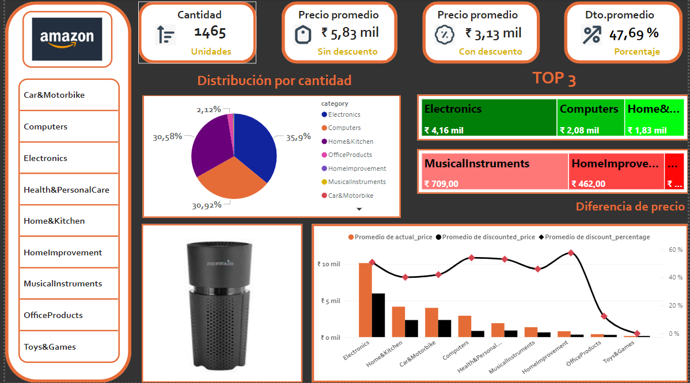

# 📊 **Amazon Product Analysis Dashboard**

Este dashboard interactivo creado con **Power BI** proporciona una visión integral sobre los productos de Amazon en diferentes categorías, analizando la cantidad de productos, precios promedios y descuentos disponibles. 

## 🚀 **Descripción del Proyecto**

Este proyecto visualiza un conjunto de datos de productos de Amazon, proporcionando información clave sobre:

- **Cantidad total de productos**
- **Precio promedio** sin descuento
- **Precio promedio** con descuento
- **Descuento promedio aplicado
  
Además, se destacan las **tres principales categorías** en términos de cantidad de productos y precios:

1. **Electronics**
2. **Computers**
3. **Home & Kitchen**

## 📈 **Análisis de Datos**

### 1. **Distribución por Categoría**
   - Gráfico circular que muestra la distribución de las principales categorías de productos en Amazon, con **Electronics** representando el 35,9% de los productos.

### 2. **TOP 3 Categorías**
   - Las tres principales categorías con mayor cantidad de productos se resaltan en verde (mayor cantidad) y rojo (menor cantidad).

### 3. **Diferencia de Precio**
   - Gráfico de barras y líneas que compara el precio promedio actual y el precio con descuento por categoría. Además, se visualiza el porcentaje de descuento aplicado a cada categoría.

## 🛠 **Tecnologías Utilizadas**

- **Power BI**: Para el diseño, modelado de datos y creación de las visualizaciones interactivas.
- **Data Source**: Conjunto de datos de productos de Amazon.

## 📂 **Cómo Usar el Dashboard**

1. **Interacción**: Puedes explorar diferentes categorías y desglosar los productos por sectores específicos, usando filtros y gráficos interactivos.
2. **Análisis Comparativo**: Evalúa cómo varían los precios entre productos con y sin descuento en diferentes categorías.

## 🎯 **Objetivos del Proyecto**

- **Análisis de descuentos**: Identificar las categorías de productos con mayores diferencias entre precio actual y precio con descuento.
- **Distribución de productos**: Observar la distribución de productos en diferentes categorías y cómo se comportan sus precios.

## 📊 **Captura de Pantalla del Dashboard**

A continuación, se muestra una captura de pantalla del dashboard:

---

### 📩 **Contribuciones**

Si deseas contribuir a este proyecto, siéntete libre de enviar un pull request o crear un issue. ¡Tu ayuda es bienvenida!

---

